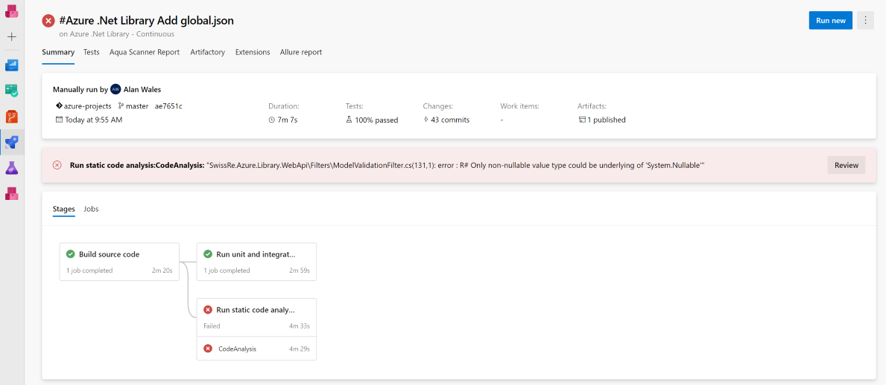
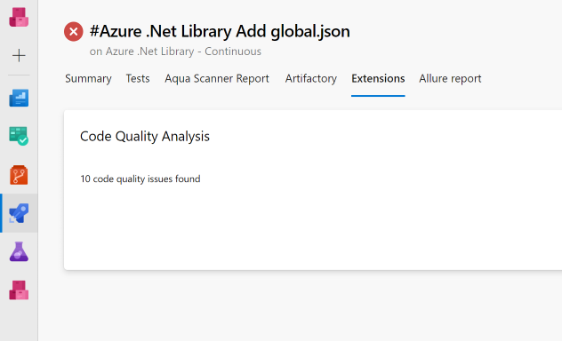
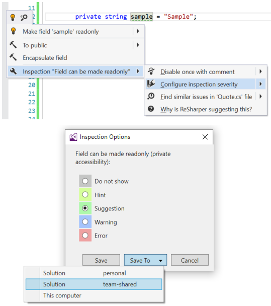

# Resharper Code Quality Analysis Task

Based on the free-to-use Resharper Command-Line Tools (CLT), this build task will automatically run over a thousand code quality checks for various languages including C# and Typescript. Add this task to your continuous build to fail the build whenever code quality standards are violated.

### Quick Setup

* Add the Resharper Code Quality Analysis task to your build template
* Set the path to your solution (.sln) or project (.csproj) file
* That's it!

**Task Versions**
> **Use Version 1 of the task** for .Net Core 2 and .Net Framework projects with the VS 2017 hosted agent for best results

> **Use Version 2 of the task** for .Net Core 3 projects using the Yaml pipeline sample for best results

**Yaml Pipeline Sample**
```yaml
name: 'Sample Code Quality Job'

trigger:
- master

variables:
- name: 'Build.Target'
  value: 'src/Test.sln'
- name: 'Build.Configuration'
  value: 'Debug'

stages:
- stage: Build
  jobs:
  - job: CodeAnalysis
    pool:
      vmImage: 'windows-2019' # note that the Resharper CLT will only work on a windows machine or container
    steps:
      - task: UseDotNet@2
        displayName: 'Import .Net Sdk'
        inputs:
          packageType: 'sdk'
          version: '3.0.100'
		
      - task: DotNetCoreCLI@2
        displayName: 'Build Target ($(Build.Target))'
        inputs:
          command: build
          projects: '$(Build.Target)'
          arguments: '--configuration $(Build.Configuration)'

      - task: ResharperCli@2
        inputs:
          solutionOrProjectPath: '$(Build.Target)'
          additionalArguments: '/disable-settings-layers:SolutionPersonal --properties:Configuration=$(Build.Configuration)'
```

**Classic Pipeline Sample**


**Build Result**




### Usage

The CLT will use the default code quality inspections to generate a report with no Resharper or Visual Studio license necessary.

**Rule Configuration**

To customize the rules, it is possible to manage the team-shared options in the Inspection Severity section from the Resharper toolbar within Visual Studio. Commit the changed sln.DotSettings file and the next build will use the updated rules.



> **Tip** The build is configured by default to fail at the Warning level. Optional improvements should be set as Suggestion or Hint in the team-shared rules to prevent unnecessary build failure. Some recommendations:

| Code issue                                                       | Languages  | Default Setting | Recommended Setting |
|------------------------------------------------------------------|------------|-----------------|---------------------|
| Redundant using directive                                        | C#, ASPX   | Warning         | Suggestion          |
| Auto-property accessor is never used (non-private accessibility) | C#, VB.NET | Warning         | Suggestion          |

[Download sample sln.DotSettings file](samples/Sample.sln.DotSettings)

> **Tip** Exclude folders which contain third-party or generated code e.g. Build, Scripts, Resources within the Resharper toolbar > Options > Code Inspection > Settings section


### Configuration

The build task will download the latest Resharper CLT from NuGet and use it for code quality inspection automatically.

Alternatively, [download the CLT](https://www.jetbrains.com/resharper/download/index.html#section=resharper-clt) and copy it to the appropriate path in the repository or build controller. This increases the speed of the code inspection task and ensures the same version is used each time.

> **Note** Please ensure that the .zip file is "unblocked" before extracting. Right click on the file, select Properties and click Unblock to avoid issues running the CLT.

##### Hosted Build Controller

Copy the folder into your repository and check the downloaded files in. The default path will be Lib\Resharper and is configurable in the build task.

##### Custom Build Controller

Either check the files in as above or copy them to the build controller. The path can then be configured to an absolute path, for example C:\Tools\Resharper.

### Legal
This extension is provided as-is, without warranty of any kind, express or implied.

Resharper is a registered trademark of JetBrains and the extension is produced independently of JetBrains. Support questions should be posted in the above Q&A section.
